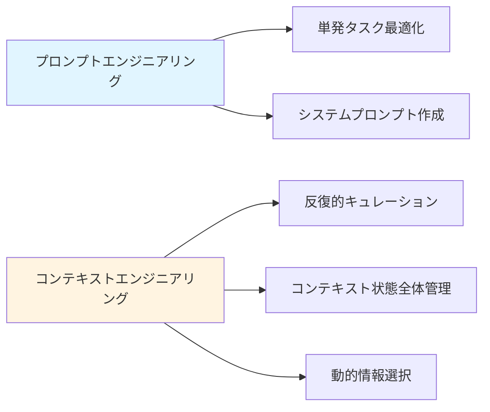
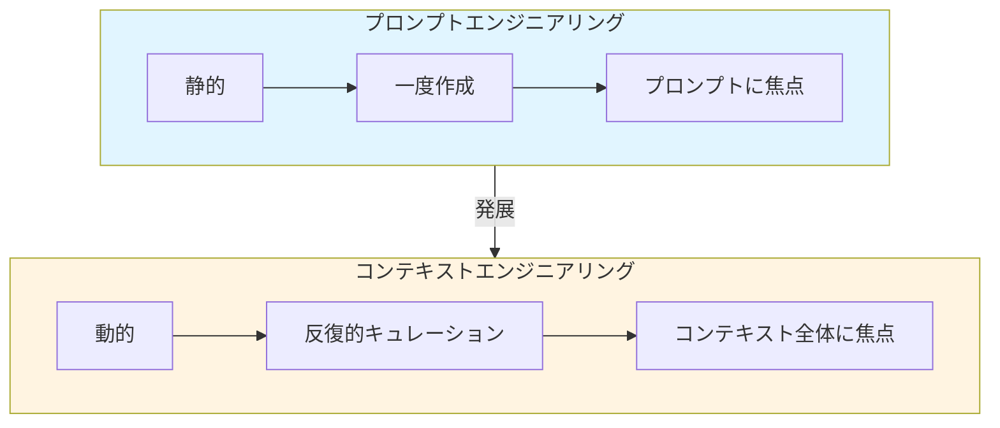
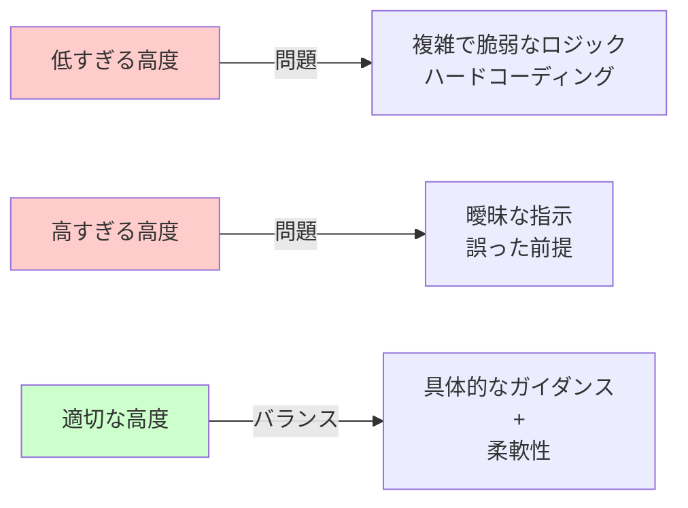
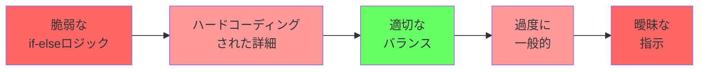
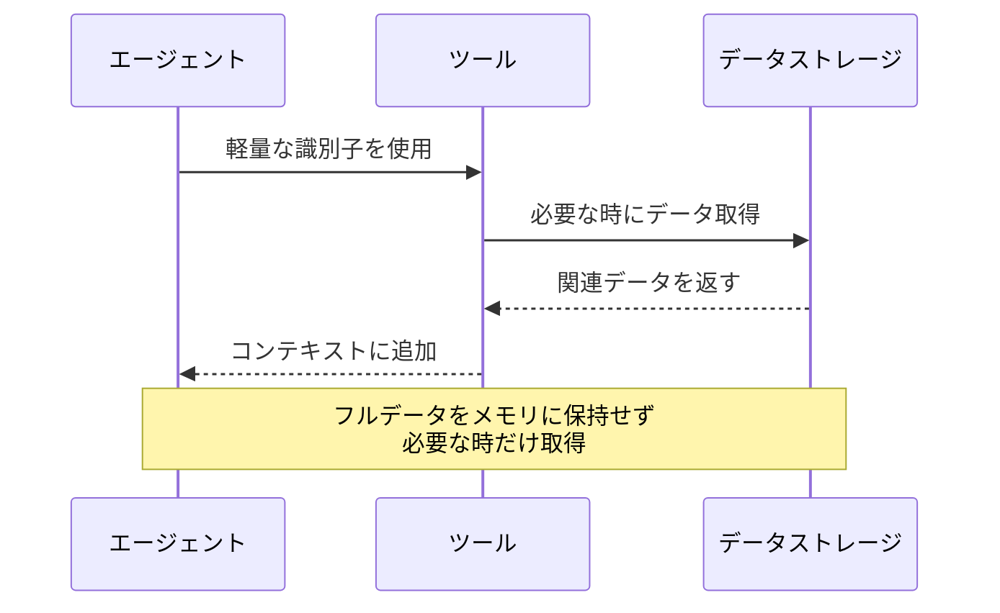
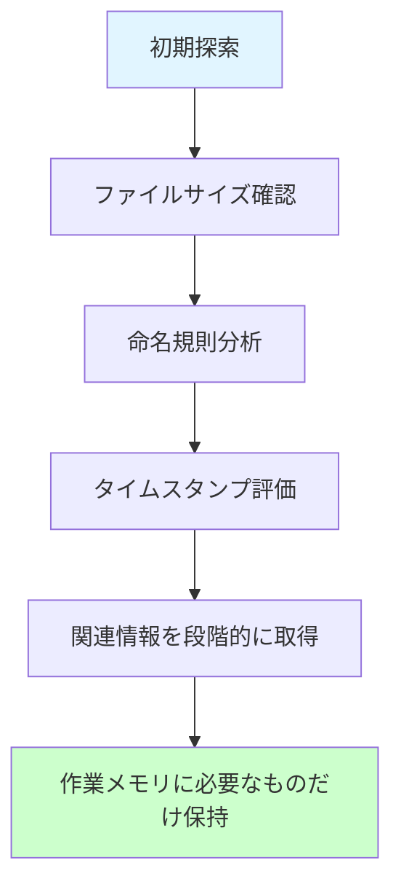
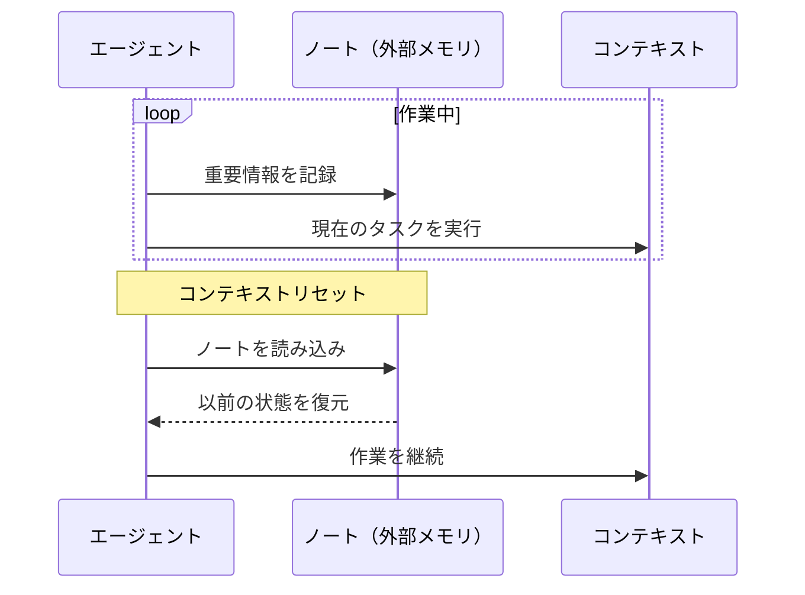
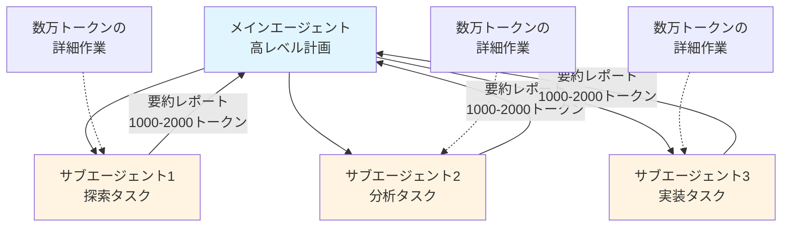
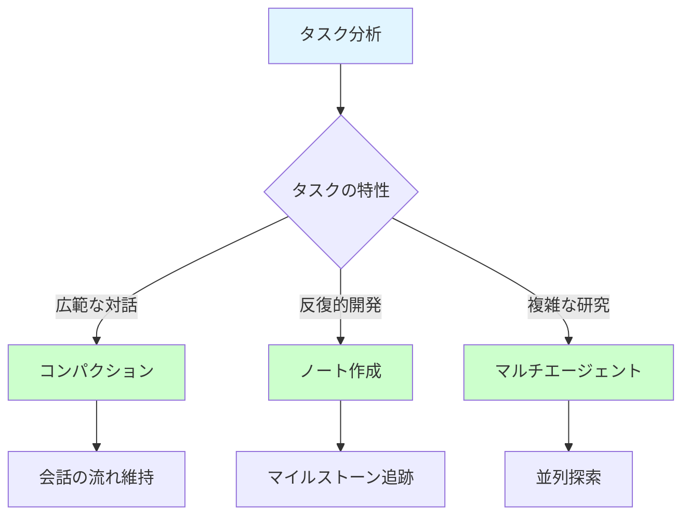

# AIエージェントのための効果的なコンテキストエンジニアリング

**公開日: 2025年9月29日** **著者: Anthropic Applied AIチーム**

## 概要

コンテキストはAIエージェントにとって重要でありながら、有限なリソースです。本記事では、AIエージェントの原動力となるコンテキストを効果的にキュレーションし、管理するための戦略を探ります。

## コンテキストエンジニアリングとは

**コンテキスト**とは、大規模言語モデル（LLM）からサンプリングする際に含まれるトークンの集合を指します。エンジニアリング上の課題は、LLM固有の制約に照らしてこれらのトークンの有用性を最適化し、一貫して望ましい結果を達成することです。

言い換えれば、LLMが特定の時点で利用可能な全体的な状態と、その状態がどのような潜在的な動作をもたらす可能性があるかを考慮する必要があります。

## コンテキストエンジニアリング vs. プロンプトエンジニアリング

### プロンプトエンジニアリング

- LLMの指示を最適な結果に導くための記述と構成手法
- 単発の分類やテキスト生成タスクに最適化されたプロンプトが中心
- システムプロンプトの作成方法に焦点

### コンテキストエンジニアリング

- LM推論中に、プロンプト以外の情報も含め、最適なトークンセットをキュレートおよび維持する戦略
- システム指示、ツール、MCP、外部データ、メッセージ履歴など、コンテキスト状態全体を管理
- 絶えず変化する可能性のある情報の中から、限られたコンテキストウィンドウに何を入れるかをキュレーション

### 主な違い

## なぜコンテキストエンジニアリングが重要なのか

### コンテキスト腐敗（Context Pollution）

研究により「コンテキスト腐敗」という概念が明らかになりました：

- コンテキストウィンドウ内のトークン数が増えると、モデルが情報を正確に思い出す能力が低下
- すべてのモデルに共通する特徴
- コンテキストは限界収益が逓減する有限のリソースとして扱う必要がある

### 注意予算（Attention Budget）

LLMには「注意予算」があります：

- 作業記憶容量が限られている人間と同様
- 新しいトークンが導入されるたびに予算が減少
- トークンを慎重に管理する必要性

### アーキテクチャ上の制約

**トランスフォーマーアーキテクチャの特性:**

- コンテキスト全体にわたってすべてのトークンが他のすべてのトークンに注目
- n個のトークンに対してn²個のペアワイズ関係
- コンテキストの長さが長くなるにつれて、これらの関係を捉える能力は限界に達する

**トレーニングデータの分布:**

- 短いシーケンスが長いシーケンスよりも一般的
- モデルはコンテキスト全体の依存関係に関する経験が少ない

**技術的対策:**

- 位置エンコーディング補間などの技術で長いシーケンスに適応
- ただし、トークンの位置理解は若干低下

## 効果的なコンテキストの構成要素

### 基本原則

**最小限の高シグナルトークンセット:** 望ましい結果の可能性を最大化する、最小限の高シグナルトークンセットを見つけること。

### 1. システムプロンプト

**適切な高度（Altitude）の重要性:**

**スペクトラム:**

**ベストプラクティス:**

- 明確でシンプルな言語を使用
- セクションごとに整理（`<background_information>`、`<instructions>`、`## Tool guidance`など）
- XMLタグやMarkdownヘッダーで区切る
- 最小限の情報セットで期待される動作を完全に概説
- 最高性能のモデルで最小限のプロンプトからテスト開始

### 2. ツール（Tools）

**ツール設計の原則:**

- エージェントが環境と対話し、新しいコンテキストを取得できるようにする
- 効率性を促進：トークン効率の良い情報を返す
- 効率的なエージェント行動を促進

**良いツールの特徴:**

- LLMによって十分に理解される
- 機能の重複が最小限
- 自己完結型
- エラーに対して堅牢
- 意図された用途が極めて明確
- 入力パラメータが記述的で曖昧でない

**よくある失敗パターン:**

- 機能をカバーしすぎる肥大化したツールセット
- どのツールを使用すべきか曖昧な決定ポイント

### 3. 例（Few-shot Prompting）

**推奨事項:**

- ✅ 多様で標準的な例のセットをキュレート
- ✅ エージェントの期待される動作を効果的に描写
- ❌ すべての可能なルールのエッジケースのリストは避ける

**原則:** 例はLLMにとって「千の言葉に値する画像」

## コンテキストの取得とエージェント検索

### エージェントの定義

**シンプルな定義:** LLMがループ内でツールを自律的に使用すること

### 「Just in Time」アプローチ

**従来のアプローチ:**

- 埋め込みベースの事前推論時検索
- すべての関連データを事前処理

**Just in Timeアプローチ:**

- 軽量な識別子を維持（ファイルパス、保存されたクエリ、Webリンクなど）
- 実行時にツールを使用してデータを動的にロード

**Claude Codeの例:**

- 対象を絞ったクエリを作成
- 結果を保存
- `head`や`tail`などのBashコマンドを活用
- 完全なデータオブジェクトをコンテキストにロードすることなく大量のデータを分析

### メタデータの重要性

ファイルシステムの例:

- `tests/test_utils.py` vs `src/core_logic/test_utils.py`
- フォルダ階層、命名規則、タイムスタンプがすべて重要なシグナルを提供

### プログレッシブディスクロージャ（Progressive Disclosure）

エージェントが段階的に関連コンテキストを発見：

1. ファイルサイズ → 複雑さを示唆
2. 命名規則 → 目的を暗示
3. タイムスタンプ → 関連性の代理指標

### トレードオフとハイブリッド戦略

**トレードオフ:**

- 実行時探索は事前計算データ取得より遅い
- 適切なツールとヒューリスティックが必要

**ハイブリッド戦略:**

- 速度のために一部のデータを事前取得
- 裁量によりさらなる自律的探索を追求

**Claude Codeのハイブリッドモデル:**

- CLAUDE.mdファイルを事前にコンテキストに投入
- `glob`や`grep`などのプリミティブで環境をナビゲート
- Just-in-timeでファイルを取得
- 古いインデックスや複雑な構文ツリーの問題を効果的に回避

## 長期タスクのためのコンテキストエンジニアリング

### 課題

長期タスクでは:

- トークン数がLLMのコンテキストウィンドウを超える
- 一貫性、コンテキスト、目標志向の動作を維持する必要
- 大規模なコードベース移行や包括的な研究プロジェクトなど

### 技術1: コンパクション（Compaction）

**定義:** コンテキストウィンドウの限界に近づいた会話を要約し、要約で新しいコンテキストウィンドウを再開始する。

**Claude Codeでの実装:**

- メッセージ履歴をモデルに渡して要約・圧縮
- 重要な詳細を保持：アーキテクチャ決定、未解決のバグ、実装詳細
- 冗長なツール出力やメッセージを破棄
- 圧縮されたコンテキスト + 最近アクセスした5つのファイル

**ベストプラクティス:**

- 複雑なエージェントトレースでプロンプトを慎重に調整
- まず再現率を最大化（すべての関連情報をキャプチャ）
- 次に適合率を向上（余分なコンテンツを排除）

**低コストのコンパクション:**

- ツール結果のクリア
- 深い履歴のツール呼び出しと結果を削除
- Claude Developer Platformの機能として提供

### 技術2: 構造化ノート作成（Structured Note-taking）

**定義:** エージェントがコンテキストウィンドウ外のメモリに定期的にノートを書き込み、後で取得する。

**メリット:**

- 最小限のオーバーヘッドで永続的なメモリを提供
- 複雑なタスク全体で進捗を追跡
- 数十のツール呼び出しにわたって失われる可能性のある重要なコンテキストと依存関係を維持

**Claude Codeの例:**

- ToDoリストの作成
- NOTES.mdファイルの維持

**ポケモンをプレイするClaudeの例:**

- 数千のゲームステップにわたって正確な集計を維持
- 「過去1,234ステップでルート1でポケモンをトレーニング、ピカチュウは目標の10レベルに向けて8レベル獲得」
- 探索した地域のマップを開発
- アンロックした主要な成果を記憶
- 戦闘戦略のメモを維持

**Claude Developer Platformのメモリツール:**

- ファイルベースのシステムを通じてコンテキストウィンドウ外に情報を保存・参照
- エージェントが時間をかけて知識ベースを構築
- セッション間でプロジェクト状態を維持
- すべてをコンテキストに保持せずに以前の作業を参照

### 技術3: サブエージェントアーキテクチャ

**概念:** プロジェクト全体の状態を維持しようとする1つのエージェントではなく、特殊化されたサブエージェントがクリーンなコンテキストウィンドウで焦点を絞ったタスクを処理。

**利点:**

- 明確な関心の分離
- 詳細な検索コンテキストはサブエージェント内に隔離
- リードエージェントは結果の統合と分析に焦点
- 複雑な研究タスクで単一エージェントシステムよりも大幅な改善

### アプローチの選択

**タスク特性に基づく選択:**

| アプローチ         | 適したタスク                                   |
| ------------------ | ---------------------------------------------- |
| コンパクション     | 広範な対話を必要とするタスク、会話の流れを維持 |
| ノート作成         | 明確なマイルストーンを持つ反復的開発           |
| マルチエージェント | 並列探索が効果的な複雑な研究と分析             |

## 結論

コンテキストエンジニアリングは、LLMを使った構築方法における根本的な変化を表しています。モデルがより高性能になるにつれて、課題は完璧なプロンプトを作成することだけではなく、各ステップでモデルの限られた注意予算にどの情報を入れるかを thoughtfully キュレーションすることです。

### 主要な原則

**最小限の高シグナルトークンセットを見つける:**

- 長期タスクのためのコンパクションの実装
- トークン効率の良いツールの設計
- エージェントが環境をJust-in-timeで探索できるようにする

### 将来の展望

- より賢いモデルは、より少ない規範的なエンジニアリングを必要とする
- エージェントがより多くの自律性を持って動作できるようになる
- しかし、コンテキストを貴重で有限のリソースとして扱うことは、信頼性が高く効果的なエージェントを構築する上で中心的であり続ける

### リソース

- [Claude Developer Platform](https://www.anthropic.com/api)
- [Memory and Context Management Cookbook](https://docs.anthropic.com/en/docs)

---

**出典:** [Anthropic Engineering Blog](https://www.anthropic.com/engineering/effective-context-engineering-for-ai-agents)
